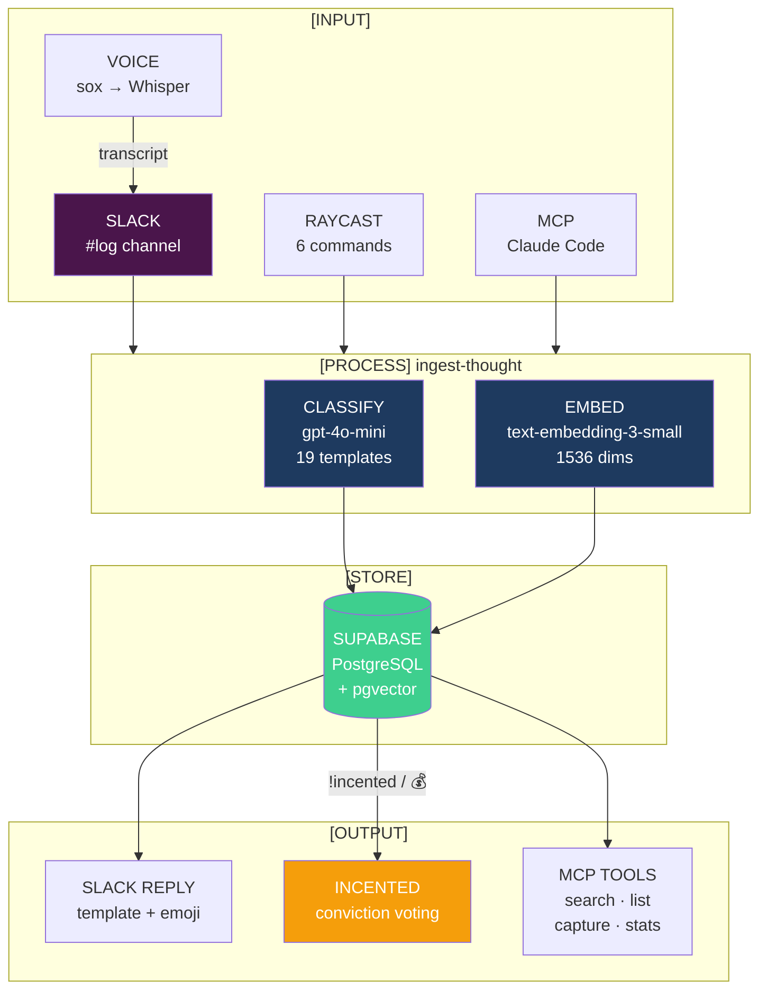
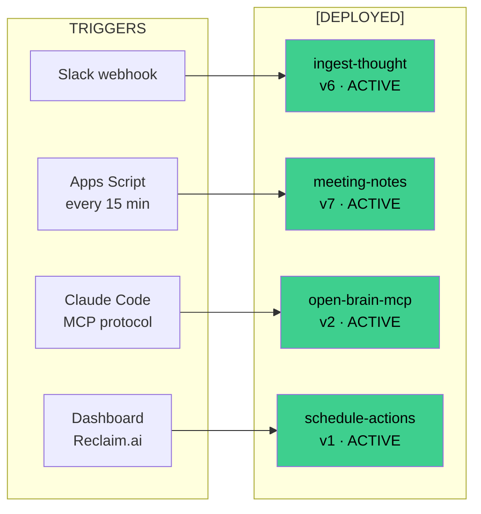
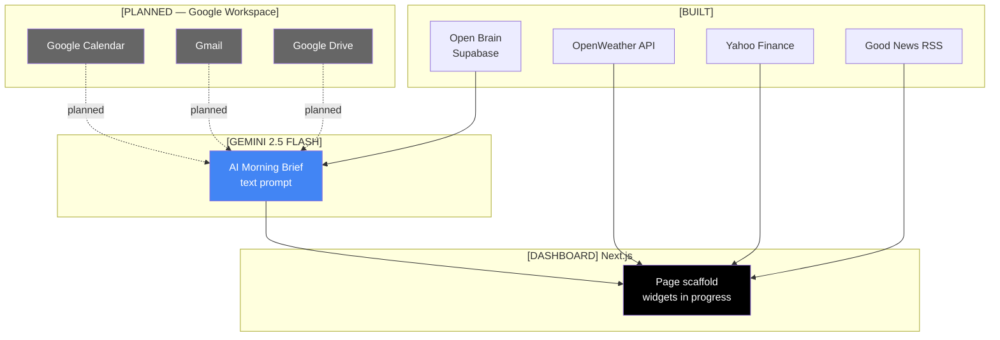
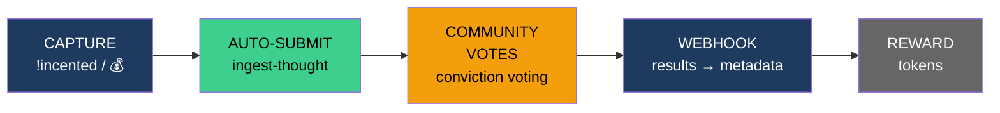

# OPEN·BRAIN

```
═══════════════════════════════════════════════════════════════
  KNOWLEDGE CAPTURE · CLASSIFICATION · ORCHESTRATION
  v2.0 · CAPTURE PIPELINE ACTIVE · 19 TEMPLATES
═══════════════════════════════════════════════════════════════
```

> The best agent is a markdown file. The best database is a folder. The best interface is the one you already know.

Open Brain is a **personal and team knowledge capture system** that turns Slack messages, voice notes, and Raycast commands into classified, embedded, searchable knowledge — then rewards quality contributions with tokens.

---

## [01] SYSTEM·ARCHITECTURE



---

## [02] TEMPLATE·SYSTEM

```
┌─────────────────────────────────────────────────────────┐
│  3 LAYERS · 19 TEMPLATES · KEYWORD-TRIGGERED            │
└─────────────────────────────────────────────────────────┘
```

| # | LAYER | TEMPLATES | TRIGGER |
|---|-------|-----------|---------|
| L1 | **TEAM CORE** (8) | Decision · Risk · Milestone · Spec · Meeting Debrief · Person Note · Stakeholder · Sent | `Decision:` `Risk:` `Milestone:` ... |
| L2 | **ROLE** (6) | Budget · Invoice · Funding · Legal · Compliance · Contract | `Budget:` `Invoice:` `Funding:` ... |
| L3 | **PERSONAL** (5) | Insight · AI Save · Nutrition · Health · Home | `Insight:` `Ate:` `Health:` ... |

```
EXAMPLE INPUT:  "Risk: Database backup not automated 💰"
         ↓
TEMPLATE:       Risk
DOMAIN:         Team Core
INCENTED:       auto-submitted for conviction voting
SLACK REPLY:    ⚠️ Risk template captured
```

---

## [03] EDGE·FUNCTIONS

Four Supabase Edge Functions — all `ACTIVE`.



| FUNCTION | PURPOSE | TRIGGER |
|----------|---------|---------|
| `ingest-thought` | Classify, embed, store, Incented auto-submit | Slack message in #log |
| `meeting-notes` | Parse Google Meet transcripts into template chunks | Apps Script (15 min interval) |
| `open-brain-mcp` | MCP server: search, list, capture, stats | Claude Code / any MCP client |
| `schedule-actions` | Fetch unscheduled actions for Reclaim.ai scheduling | Dashboard API call |

---

## [04] CAPTURE·METHODS

```
┌─────────────────────────────────────────────────────────┐
│  CAPTURE FROM ANYWHERE · CLASSIFY AUTOMATICALLY          │
└─────────────────────────────────────────────────────────┘
```

### SLACK
```
#log channel → "Decision: Launch strategy !incented"
                         ↓
              ingest-thought webhook
                         ↓
              ✅ Decision template captured
```

### VOICE
```bash
cd integrations/raycast && ./voice-capture-cli.sh
# sox records → Whisper transcribes → sent directly to Open Brain via MCP
```

### RAYCAST

| COMMAND | KEY | PURPOSE |
|---------|-----|---------|
| Capture Thought | `obc` | Form-based with paste options |
| Search Thoughts | `obs` | Semantic search with scores |
| List Recent | `obl` | Browse with type filters |
| Statistics | `obst` | Totals, topics, people |
| Quick Capture | `obq` | Command-line instant |
| Voice Capture | `obv` | Record → transcribe → capture |

### MCP (CLAUDE CODE)
```
search_thoughts("database migration")
capture_thought("Insight: Vector search is faster than keyword")
thought_stats()
list_thoughts({ type: "decision", limit: 10 })
```

---

## [05] MORNING·BRIEF

> **Status:** Dashboard scaffold built. Gemini brief returns AI-generated summaries. Google Workspace integration (Calendar, Gmail, Drive) is planned — currently uses Gemini's general knowledge. Weather, finance, and news widgets have API routes but need frontend wiring fixes.



---

## [06] INCENTED·REWARDS

Token-based conviction voting for knowledge contributions. API routes and auto-submit pipeline built. Dashboard UI components exist but are not yet wired into the main page.



> **Status:** Auto-submit via `!incented` flag works in ingest-thought. Submit/webhook API routes built. Manual submit UI component exists (`IncentedStatus.tsx`) but not rendered in main dashboard page. Webhook signature verification pending.

---

## [07] ROADMAP

```
┌──────────────────────────────────────────────────┐
│  PHASE    STATUS       DESCRIPTION               │
├──────────────────────────────────────────────────┤
│  0        ✅ COMPLETE   Foundation + capture       │
│  1        ✅ COMPLETE   19 templates (3 layers)    │
│  2        ✅ COMPLETE   Meeting notes automation   │
│  3        ◐ PROGRESS   Team onboarding            │
│  4        ◐ PROGRESS   Morning brief dashboard    │
│  4.5      ✅ COMPLETE   Raycast extension (built)  │
│  4.6      ◐ PROGRESS   Smart scheduler (API done) │
│  4.7      ◐ PROGRESS   Incented (API + auto-sub)  │
│  5        ○ PLANNED    To-do integration           │
│  6        ○ PLANNED    Nutrition tracking           │
│  7        ○ PLANNED    Gmail parsing               │
│  8        ○ PLANNED    Weekly review automation    │
│  9-15     ○ PLANNED    Doc types · Schema · ACL    │
│  16       ○ PLANNED    Knowledge bounty system     │
└──────────────────────────────────────────────────┘
```

See [ROADMAP.md](ROADMAP.md) for full details.

---

## [08] PROJECT·STRUCTURE

```
openBrain/
├── ROADMAP.md                      # 16-phase development plan
├── CLAUDE.md                       # Agent routing instructions
├── PROJECT_STATUS.md               # Current system status
├── HANDOVER.md                     # v2.0 handover document
│
├── apps/my-app/                    # Morning Brief dashboard
│   ├── app/
│   │   ├── api/
│   │   │   ├── gemini-brief/       # AI morning summary
│   │   │   ├── incented/           # Submit + webhook
│   │   │   ├── reclaim/            # Smart scheduler
│   │   │   ├── weather/            # OpenWeather
│   │   │   ├── finance/            # Renewable tickers
│   │   │   └── news/               # Good News RSS
│   │   └── components/
│   │       ├── GeminiBrief.tsx      # AI brief display
│   │       ├── SmartScheduleButton  # Reclaim integration
│   │       ├── IncentedStatus.tsx   # Token rewards UI
│   │       └── ...                  # Weather, Finance, News
│   └── lib/supabase.ts             # DB client
│
├── integrations/
│   └── raycast/                    # macOS quick capture
│       ├── src/api.ts              # MCP client
│       ├── voice-capture-cli.sh    # Voice → Whisper → Slack
│       └── ...                     # 5 command components
│
├── prompts/                        # Agent system prompts
├── scripts/                        # CLI tools
├── docs/                           # Architecture docs
│   ├── INCENTED-INTEGRATION.md
│   ├── DATA-INTAKE-ARCHITECTURE.md
│   └── TSM-ORGANIZATIONAL-FRAMEWORK.md
│
└── stubs/                          # Future integrations
```

Supabase Edge Functions live in `~/supabase/functions/` (separate deployment).

---

## [09] QUICK·START

```bash
git clone https://github.com/idirkev/openBrain.git
cd openBrain

# Dashboard
cd apps/my-app
cp .env.local.example .env.local    # Add Supabase + API keys
npm install && npm run dev          # http://localhost:3000

# Voice capture
cd integrations/raycast
./voice-capture-cli.sh

# Raycast extension
cd integrations/raycast
npm install && npm run build
# Import via Raycast preferences
```

### Environment Variables

```
NEXT_PUBLIC_SUPABASE_URL        # Supabase project URL
NEXT_PUBLIC_SUPABASE_ANON_KEY   # Supabase anon key
SUPABASE_SERVICE_ROLE_KEY       # Supabase service role
MCP_ACCESS_KEY                  # Open Brain MCP access
GEMINI_API_KEY                  # Gemini 2.5 Flash
RECLAIM_API_KEY                 # Reclaim.ai scheduling
OPENWEATHER_API_KEY             # Weather widget
```

---

## [10] AGENT·MODEL

```
┌─────────────────────────────────────────────────────────┐
│  ROLE              MODEL              COST    PURPOSE   │
├─────────────────────────────────────────────────────────┤
│  ARCHITECT         Claude Opus 4.6    High    Decide    │
│  BUILDER           Claude Sonnet 4.6  Medium  Ship      │
│  QUALITY GATE      Codex CLI          High    Verify    │
│  CLASSIFIER        gpt-4o-mini        Low     Classify  │
│  EMBEDDER          text-emb-3-small   Low     Embed     │
│  MORNING BRIEF     Gemini 2.5 Flash   Free    Summarise │
└─────────────────────────────────────────────────────────┘
```

---

## [11] COSTS

| SERVICE | COST |
|---------|------|
| Whisper API | ~$0.006/min |
| OpenRouter (classify + embed) | ~$0.001/capture |
| Gemini API | Free tier |
| Supabase | Free tier |
| Vercel | Free tier |
| Incented | Gas fees only |

**Alternative:** Local whisper.cpp = $0 (2GB model download)

---

```
═══════════════════════════════════════════════════════════════
  OPEN·BRAIN · v2.0 · CAPTURE ACTIVE · DASHBOARD IN PROGRESS
  Built by idirnet · Routed through markdown
═══════════════════════════════════════════════════════════════
```
