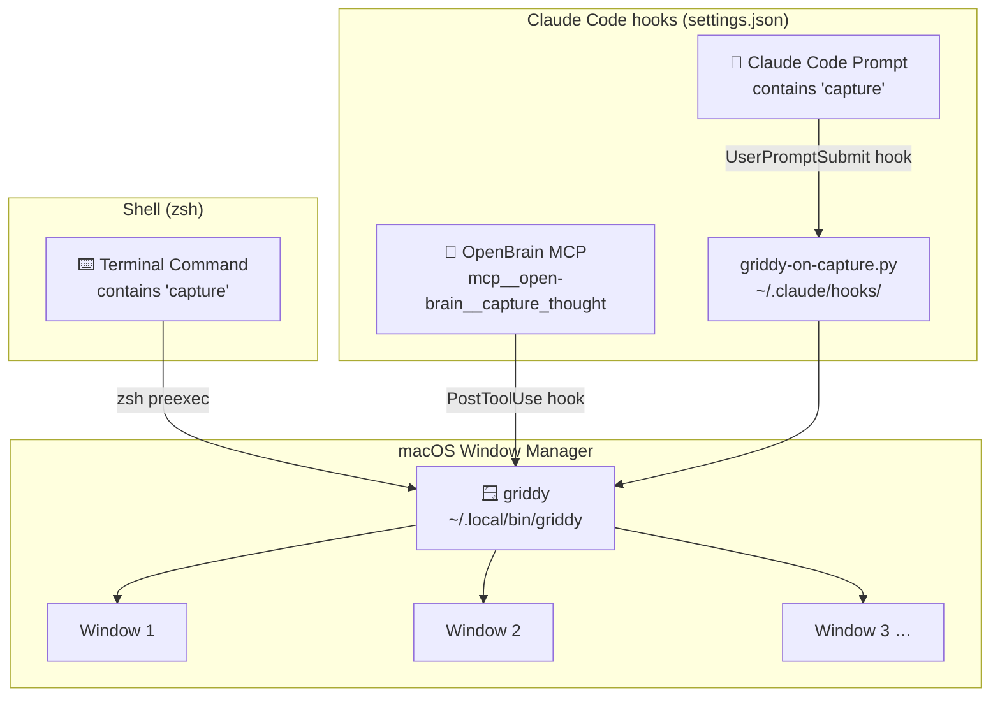

# Griddy Capture Hook Architecture

**Date:** 2026-03-18

## Overview

`griddy` is a macOS window tiling utility. This integration automatically fires `griddy` whenever an OpenBrain capture event occurs, keeping the workspace organized without any manual intervention.

Three independent trigger paths all converge on the same binary at `~/.local/bin/griddy`.

## Flowchart

## Trigger Paths

### 1. OpenBrain MCP — PostToolUse hook

When Claude Code calls `mcp__open-brain__capture_thought`, the `PostToolUse` hook in `~/.claude/settings.json` fires `$HOME/.local/bin/griddy` directly. This is the primary path and requires no intermediate script — the binary is invoked immediately after the tool completes, asynchronously so it never delays the response.

### 2. Claude Code Prompt — UserPromptSubmit hook

When a user prompt submitted to Claude Code contains the word "capture", the `UserPromptSubmit` hook runs `griddy-on-capture.py`. The Python script reads the prompt JSON from stdin, checks for the keyword, and spawns `griddy` via `subprocess.Popen` if matched. The script is wrapped in a broad `try/except` so it can never block a prompt — failures are silently swallowed.

### 3. Terminal Command — zsh preexec

When any command containing "capture" is run in the terminal, the `_griddy_capture_preexec` zsh function fires before the command executes. It pattern-matches `$1` (the full command string) and runs `griddy` in the background with stdout/stderr suppressed. This path is independent of Claude Code entirely and works in any zsh session where the snippet has been sourced.

## Files

| Path | Purpose |
|---|---|
| `integrations/griddy/README.md` | Package overview and quick-start |
| `integrations/griddy/install.sh` | One-shot installer |
| `integrations/griddy/settings-snippet.json` | Hook entries to merge into `~/.claude/settings.json` |
| `integrations/griddy/hooks/griddy-on-capture.py` | UserPromptSubmit hook script |
| `integrations/griddy/hooks/griddy-capture.zsh` | zsh preexec snippet (source in `.zshrc`) |
| `docs/architecture/GRIDDY-CAPTURE-HOOKS.md` | This document |
